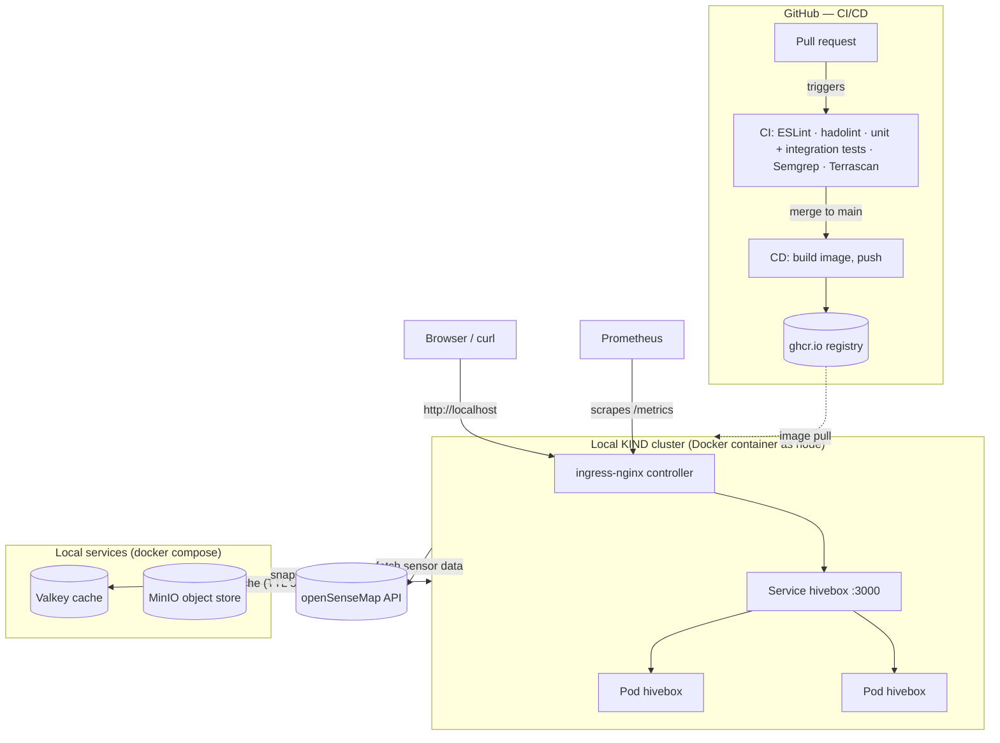

[](https://devopsroadmap.io/getting-started/)
[](https://newsletter.devopsroadmap.io/subscribe)
[](https://t.me/DevOpsHive/985)
[](https://github.com/DevOpsHiveHQ/devops-hands-on-project-hivebox/fork)

# HiveBox - DevOps End-to-End Hands-On Project

<p align="center">
  <a href="https://devopsroadmap.io/projects/hivebox" style="display: block; padding: .5em 0; text-align: center;">
    
  </a>
</p>

> [!CAUTION]
> **[Fork](https://github.com/DevOpsHiveHQ/devops-hands-on-project-hivebox/fork)** this repo, and create PRs in your fork, **NOT** in this repo!

> [!TIP]
> If you are looking for the full roadmap, including this project, go back to the [getting started](https://devopsroadmap.io/getting-started) page.

This repository is the starting point for [HiveBox](https://devopsroadmap.io/projects/hivebox/), the end-to-end hands-on project.

You can fork this repository and start implementing the [HiveBox](https://devopsroadmap.io/projects/hivebox/) project. HiveBox project follows the same Dynamic MVP-style mindset used in the [roadmap](https://devopsroadmap.io/).

The project aims to cover the whole Software Development Life Cycle (SDLC). That means each phase will cover all aspects of DevOps, such as planning, coding, containers, testing, continuous integration, continuous delivery, infrastructure, etc.

Happy DevOpsing ♾️

## Before you start

Here is a pre-start checklist:

- ⭐ <a target="_blank" href="https://github.com/DevOpsHiveHQ/dynamic-devops-roadmap">Star the **roadmap** repo</a> on GitHub for better visibility.
- ✉️ <a target="_blank" href="https://newsletter.devopsroadmap.io/subscribe">Join the community</a> for the project community activities, which include mentorship, job posting, online meetings, workshops, career tips and tricks, and more.
- 🌐 <a target="_blank" href="https://t.me/DevOpsHive/985">Join the Telegram group</a> for interactive communication.

## Preparation

- [Create GitHub account](https://docs.github.com/en/get-started/start-your-journey/creating-an-account-on-github) (if you don't have one), then [fork this repository](https://github.com/DevOpsHiveHQ/devops-hands-on-project-hivebox/fork) and start from there.
- [Create GitHub project board](https://docs.github.com/en/issues/planning-and-tracking-with-projects/creating-projects/creating-a-project) for this repository (use `Kanban` template).
- Each phase should be presented as a pull request against the `main` branch. Don’t push directly to the main branch!
- Document as you go. Always assume that someone else will read your project at any phase.
- You can get senseBox IDs by checking the [openSenseMap](https://opensensemap.org/) website. Use 3 senseBox IDs close to each other (you can use the following [5eba5fbad46fb8001b799786](https://opensensemap.org/explore/5eba5fbad46fb8001b799786), [5c21ff8f919bf8001adf2488](https://opensensemap.org/explore/5c21ff8f919bf8001adf2488), and [5ade1acf223bd80019a1011c](https://opensensemap.org/explore/5ade1acf223bd80019a1011c)). Just copy the IDs, you will need them in the next steps.

<br/>
<p align="center">
  <a href="https://devopsroadmap.io/projects/hivebox/" imageanchor="1">
    
  </a><br/>
</p>

---

## Implementation

The project was built incrementally, one pull request per phase, against a protected `main` branch.

### Architecture



### Phase 1 — Core API

Express (Node 22, ES modules) app in [`OpenSenseAPI.js`](OpenSenseAPI.js), with the pure temperature logic split into [`temperature.js`](temperature.js) so it is testable without network or server.

| Endpoint | Behaviour |
|---|---|
| `GET /version` | Returns the deployed app version |
| `GET /temperature` | Average of three senseBoxes' current temperature (readings older than 1 hour are discarded) plus a `status` band: `<10` Too Cold, `10–36` Good, `>36` Too Hot. `404` if no fresh data, `502` if openSenseMap is unreachable |
| `GET /metrics` | Prometheus metrics (see Phase 5) |
| `GET /store` | Writes the current temperature snapshot to MinIO immediately (see Phase 9) |

### Phase 2 — Testing

Node's built-in test runner (`node --test`, zero test dependencies), in [`test/`](test):

- **Unit tests** — the averaging/freshness/status functions in isolation.
- **Integration tests** — boot the real app on a random port and make real HTTP requests; only the openSenseMap boundary is faked (a URL-routing `fetch` stub), which makes the failure paths (stale data → 404, upstream down / malformed JSON → 502) testable on demand.

### Phase 3 — Containerization

[`Dockerfile`](Dockerfile): `node:22-alpine`, dependency layer cached before source copy, runs as the non-root `node` user, and executes `node` directly (no npm wrapper) so the container works with a read-only root filesystem.

### Phase 4 — Continuous Integration

[`main.yml`](.github/workflows/main.yml) runs on every PR and push to `main`, as parallel jobs:

- **build** — ESLint, hadolint (Dockerfile lint), unit + integration tests.
- **semgrep** — static security analysis of the code and workflows.
- **terrascan** — policy scan of the Kubernetes manifests (pinned `tenable/terrascan:1.19.9` image; three rules skipped with documented justification as inapplicable to a local KIND deploy).

All third-party actions are pinned to full commit SHAs (supply-chain hardening).

### Phase 5 — Observability

`prom-client` exposes default Node process metrics at `/metrics` in Prometheus exposition format. [`prometheus.yml`](prometheus.yml) contains the scrape config (15s interval); run Prometheus in Docker with the config mounted, and it reaches the app on the host via `host.docker.internal:3000`.

Custom metrics based on the app's logic: `/temperature` outcomes counter (ok / no fresh data / upstream error), openSenseMap fetch-latency histogram, fresh-readings gauge, last-average gauge, per-route HTTP duration histogram, and cache hit/miss counter (Phase 9).

### Phase 6 — Kubernetes on KIND

- [`kind-config.yaml`](kind-config.yaml) — single-node KIND cluster with the two ingress prerequisites: the `ingress-ready=true` node label and host port mappings 80/443 into the node container.
- [`k8s/deployment.yaml`](k8s/deployment.yaml) — 2 replicas, readiness + liveness probes on `/version`, resource requests/limits.
- [`k8s/service.yaml`](k8s/service.yaml) — ClusterIP service on 3000 selecting the pods by label.
- [`k8s/ingress.yaml`](k8s/ingress.yaml) — catch-all nginx-class ingress, so `http://localhost/` reaches the app.

Bring-up:

```bash
kind create cluster --config kind-config.yaml
docker build -t hivebox:latest .
kind load docker-image hivebox:latest
kubectl apply -f https://raw.githubusercontent.com/kubernetes/ingress-nginx/main/deploy/static/provider/kind/deploy.yaml
kubectl wait --namespace ingress-nginx --for=condition=ready pod --selector=app.kubernetes.io/component=controller --timeout=180s
kubectl apply -f k8s/
curl http://localhost/version
```

### Phase 7 — Security hardening

Driven by the Semgrep/Terrascan/SonarLint findings, verified by re-running the scanners to zero findings:

- Pods run non-root (uid 1000) with `allowPrivilegeEscalation: false`, read-only root filesystem, all capabilities dropped, default seccomp and AppArmor profiles.
- `automountServiceAccountToken: false` — the app never talks to the Kubernetes API, so no cluster credential is mounted into an internet-facing pod.
- CPU/memory/ephemeral-storage requests and limits bound the blast radius of resource-exhaustion DoS.

### Phase 8 — Continuous Delivery

[`cd.yml`](.github/workflows/cd.yml) runs on every push to `main` (i.e. every merge): builds the image and pushes it to GitHub Container Registry as `ghcr.io/hydra2113/devops-hands-on-project-hivebox`, tagged both `main-<shortsha>` (immutable, for traceability and rollback) and `latest`. Authentication uses the workflow's built-in `GITHUB_TOKEN` with least-privilege `packages: write` permission — no manually managed secrets.

### Phase 9 — Caching and storage

Two stateful services, run locally (and in CI) via [`docker-compose.yml`](docker-compose.yml):

- **Valkey cache** ([`cache.js`](cache.js)) — `/temperature` responses are cached for 5 minutes (measured: ~1300ms miss → ~60ms hit). **Fail-open by design**: any cache error is treated as a miss and the app recomputes from openSenseMap, so a dead Valkey degrades to slower responses, never an outage. The client fails fast (2s connect cap, 2 retries, no offline queue) and reconnects on its own when Valkey returns.
- **MinIO object store** ([`storage.js`](storage.js)) — a JSON temperature snapshot is written to the auto-created `hivebox` bucket every 5 minutes, and immediately on `GET /store` (keys like `temperature/2026-07-13T03-16-33Z.json`). **Not fail-open**: a failed write is data loss, so errors surface (502 on `/store`).
- Configuration is entirely env vars (`VALKEY_URL`, `S3_ENDPOINT`, `S3_ACCESS_KEY`, `S3_SECRET_KEY`, `S3_BUCKET`) with localhost defaults, so `docker compose up -d` + `npm start` works with zero setup.
- Integration tests run against the real Valkey and MinIO (CI boots the same compose file and health-gates before testing); only openSenseMap stays faked.

Known limitation (deliberate): each replica runs its own 5-minute timer, so multiple pods write duplicate snapshots — the upgrade path is a Kubernetes CronJob.
